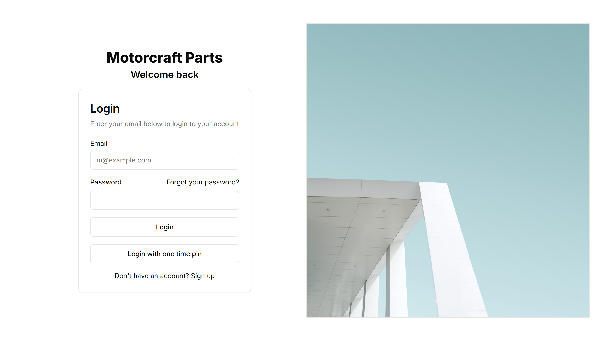
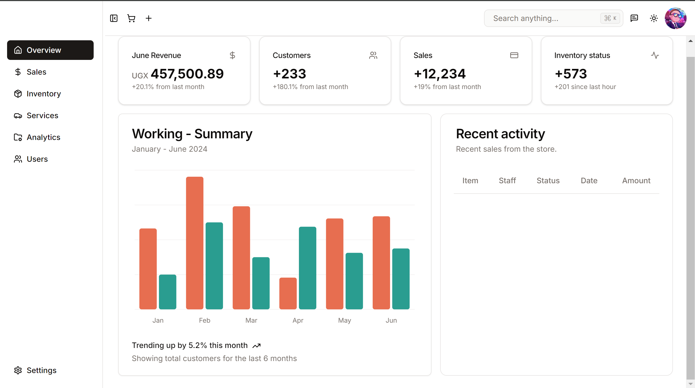
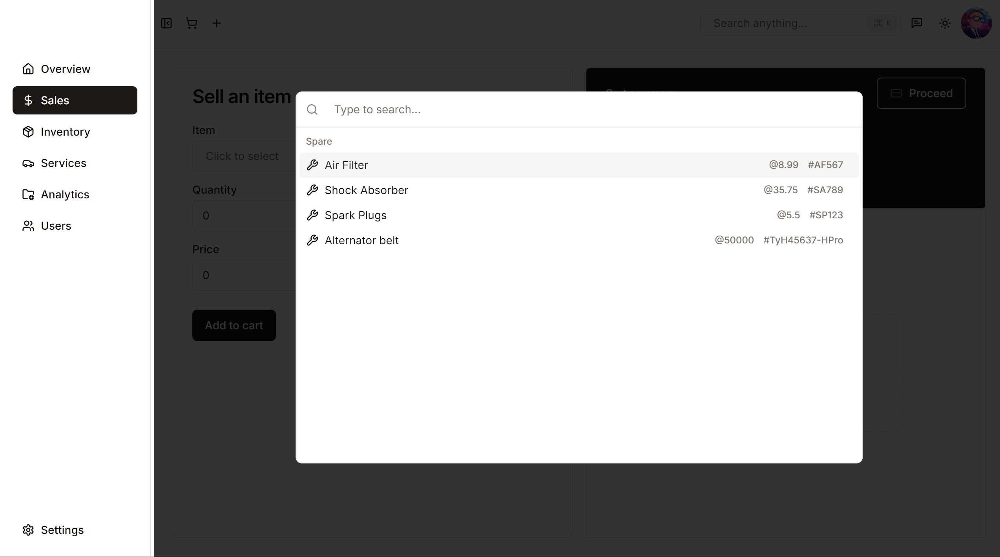
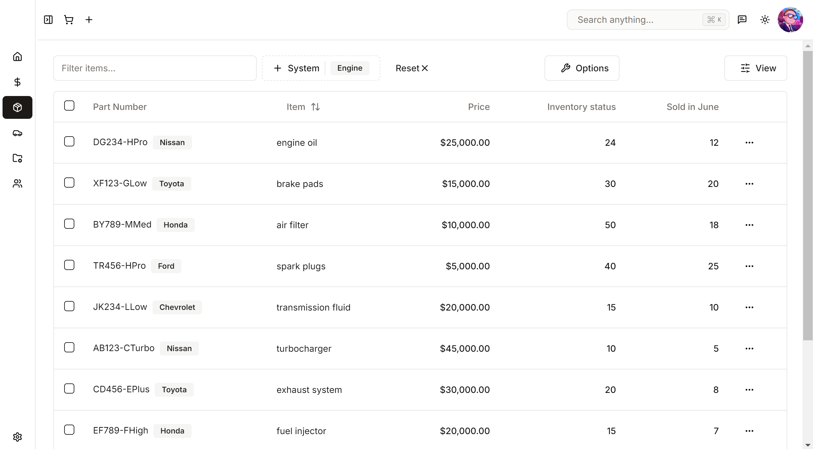
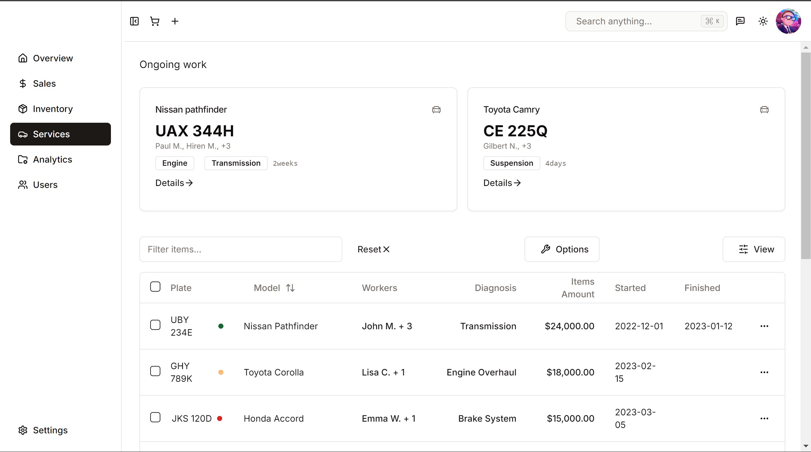

# PreS

This is an intranet business management system for a workshop (spare) company and vehicle technical services, to track their cash flow, vehicle services, spare flow and sales, plus the clients and employees. 

Some pages are still under development, b'se I didn't know which features this company would need.  

I used Next.js(app router), tailwindCSS, supabase (later intend to incorporate own SQL db, I also like sequelizeJS), etc.

## Demo

To sample the design:

```bash
# clone the repo, cd into it, and run dev server
git clone https://github.com/hiren-maddara/mcparts.git
cd mcparts

# then
npm run dev
```

## Samples

### Login and dashboard




### Sales 


### Inventory


### Services


# Features
Automated and user friendly selling of spare
Feedback system 
Modern and intuitive UI
Big data display and handling in inventory and services
Stats summaries and reviews
...etc