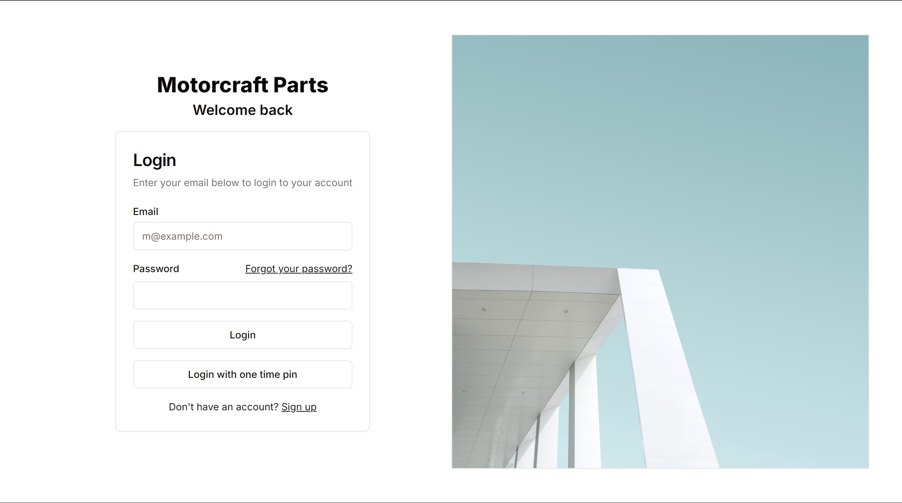
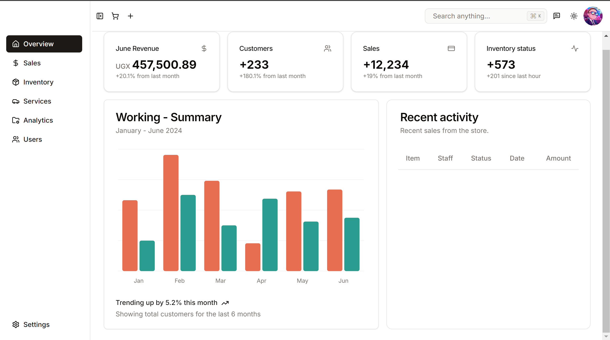
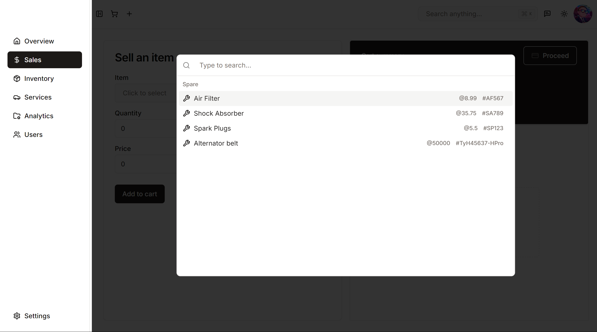
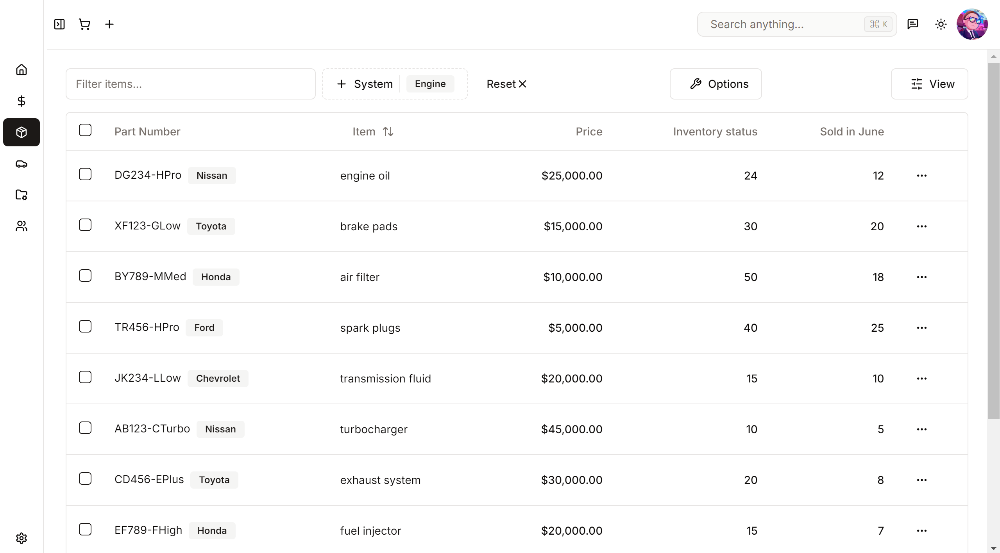
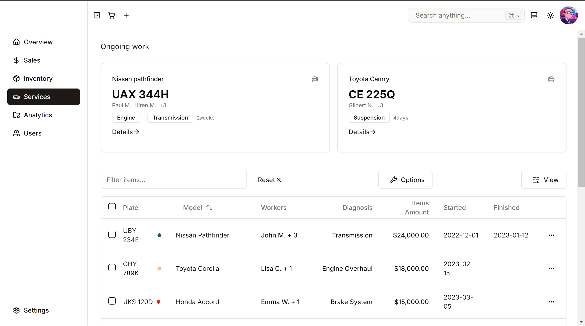

# Poject Overview

This is a stripped-dwon sample of a full-stack intranet business management system I built for a vehicle workshop, spare parts supplier, and technical services provider where I worked. It replaces inefficient manual data entry and improves tracking of cash flow, vehicle services, inventory, sales, clients, and employees. The web app connects to a native SQLite3 database via Sequelize ORM for secure, structured storage, and syncs with a Supabase database for remote access and backups—both schemed from scratch. Key features include full CRUD operations, an admin dashboard, user authentication, a customizable UI, interactive charts, and spreadsheet-style data management

## Demo
To see online demo, visit:
[https://mcparts.netlify.app](https://mcparts.netlify.app)


To run the code yourself:

```bash
# clone the repo, cd into it, and run dev server
git clone https://github.com/hiren-maddara/mcparts.git
cd mcparts

# then
npm run dev
```

## Samples

### Login and dashboard




### Sales 


### Inventory


### Services


